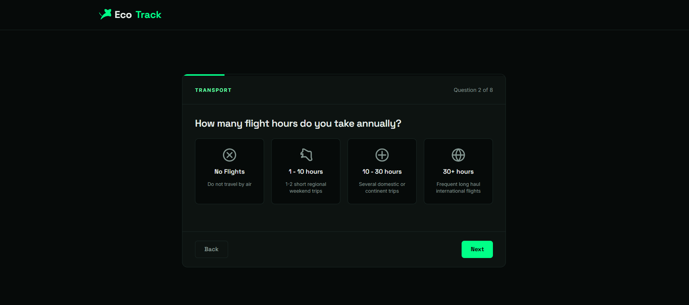
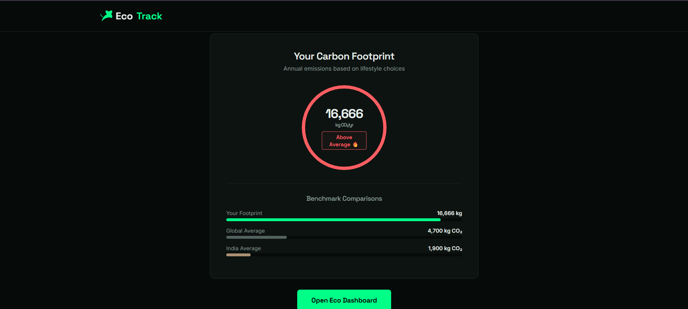
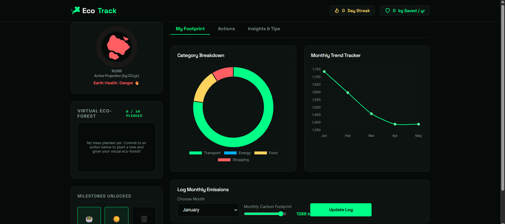

# 🌍 EcoTrack — Personal Carbon Footprint Tracker

<div align="center">


[](images/1.png)
[](images/2.png)
[](images/3.png)
[](images/5.png)
[](images/8.png)

**Understand. Track. Reduce. 🌱**

*A project helping individuals take real climate action through personalized insights.*

[Live Demo](#) · [Report Bug](../../issues) · [Request Feature](../../issues)

</div>

---

## 📌 Table of Contents

- [About the Project](#-about-the-project)
- [Features](#-features)
- [Screenshots](#-screenshots)
- [How It Works](#-how-it-works)
- [Carbon Emission Factors](#-carbon-emission-factors)
- [Tech Stack](#-tech-stack)
- [Getting Started](#-getting-started)
- [Project Structure](#-project-structure)
- [Roadmap](#-roadmap)
- [Contributing](#-contributing)
- [License](#-license)
- [Acknowledgements](#-acknowledgements)

---

## 🌿 About the Project

> *"The average person emits 4.7 tonnes of CO₂ per year. Most don't know it. EcoTrack changes that."*

**EcoTrack** is a single-page web application that helps individuals understand, visualize, and reduce their personal carbon footprint through a lifestyle quiz, real-time calculations, and AI-curated action plans.

Built for a hackathon around the problem statement:
> *"Design a solution that helps individuals understand, track, and reduce their carbon footprint through simple actions and personalized insights."*

### Why EcoTrack?

- 🌐 Most people don't know their carbon footprint — EcoTrack makes it **visible in minutes**
- 🎯 Generic climate tips don't work — EcoTrack gives **personalized, ranked actions**
- 📊 Behavior change requires feedback loops — EcoTrack provides **progress tracking and streaks**
- 🚀 No signup, no server, no friction — runs **entirely in the browser**

---

## ✨ Features

### 🧩 Lifestyle Quiz
- 6–8 questions across **Transport, Energy, Food, and Shopping** categories
- Beautiful card-based UI with icons and smooth slide animations
- Zero dropdowns — fully visual and intuitive

### 📊 Carbon Score Calculator
- Real-world emission factors used for accurate CO₂ estimates (kg/year)
- Animated circular gauge with color-coded rating:
  - 🟢 **Below Average** — under 4,000 kg CO₂/year
  - 🟡 **Average** — 4,000–8,000 kg CO₂/year
  - 🔴 **Above Average** — over 8,000 kg CO₂/year
- Comparison against **global average (4,700 kg)** and **India average (1,900 kg)**

### 🎛️ Personalized Dashboard (3 Tabs)

| Tab | What You Get |
|-----|-------------|
| **My Footprint** | Donut chart by category + monthly trend line graph |
| **Actions** | 10 impact-ranked action cards filtered to your biggest emission source |
| **Insights** | Fun equivalencies (trees, coal, km driven) + weekly Eco Tip |

### 🏅 Gamification & Progress
- Commitment cards — click "I'll do this!" to lock in an action
- Live **CO₂ saved counter** that updates as you commit
- **Streak tracker** for eco-action logging
- **Badge system**: Plant-Based Pioneer 🌱, Solar Champion ☀️, Zero-Waste Warrior ♻️

### 💾 Persistent Storage
- All data saved to **localStorage** — no account needed
- Progress survives browser refresh
- Full reset option available

---

## 📸 Screenshots

> *(Add screenshots here after building the app)*

| Quiz Screen | Results Screen | Dashboard |
|:-----------:|:--------------:|:---------:|
|  |  |  |

---

## ⚙️ How It Works

```
User fills Quiz
      ↓
FootprintCalculator computes CO₂ by category
      ↓
Score displayed with gauge + comparisons
      ↓
ActionRecommender filters top actions by highest emission category
      ↓
User commits to actions → CO₂ savings tracked live
      ↓
Dashboard updates charts, streaks, and badges
      ↓
All state saved to localStorage
```

---

## 🔢 Carbon Emission Factors

All calculations use scientifically grounded emission factors:

| Activity | Emission Factor |
|----------|----------------|
| Car commute (average) | 2.4 kg CO₂ / day |
| Short-haul flight | ~255 kg CO₂ / flight hour |
| Grid electricity (India avg) | ~0.82 kg CO₂ / kWh |
| Heavy meat diet vs. vegan | +1,800 kg CO₂ / year |
| Fast fashion (per purchase) | ~200 kg CO₂ / item/year |
| Food waste (avg household) | ~300 kg CO₂ / year |

> Sources: IPCC, Our World in Data, EPA GHG Calculator, Carbon Independent

---

## 🛠️ Tech Stack

- **HTML5** — structure
- **CSS3** — dark-mode design system, animations, responsive layout
- **Vanilla JavaScript** — quiz engine, calculator, recommender, storage
- **[Chart.js 4.4.1](https://www.chartjs.org/)** — donut chart and line graph (via CDN)
- **[Google Fonts](https://fonts.google.com/)** — Space Grotesk + Inter
- **localStorage API** — client-side persistence

> No frameworks. No build tools. No dependencies to install. Just open and run.

---

## 🚀 Getting Started

```bash
# Clone the repository
git clone https://github.com/your-username/carbon-tracker.git

cd carbon-tracker

# Install dependencies
npm install

# Start the app
node server.js
```

Then visit `http://localhost:3000`

### Requirements
- Any modern browser (Chrome, Firefox, Safari, Edge)
- Internet connection (for Chart.js and Google Fonts CDN)
- No installation, no Node.js, no build step required

---

## 📁 Project Structure
```
CARBON-BO.../
│
├── images/             # Icons, illustrations, and static assets
├── node_modules/       # npm dependencies (auto-generated)
├── app.js              # Core application logic
├── index.html          # Main entry point
├── package.json        # Project metadata and dependencies
├── package-lock.json   # Locked dependency versions
├── README.md           # Project documentation
├── server.js           # Local development server
└── style.css           # Global styles and dark-mode design system
```

**JavaScript modules inside `index.html`:**

```
QuizEngine          → manages quiz state and question flow
FootprintCalculator → computes CO₂ score from quiz answers
ActionRecommender   → filters and ranks action cards by category
DashboardRenderer   → renders charts, badges, insights
StorageManager      → reads/writes all state to localStorage
```

---

## 🗺️ Roadmap

- [x] Lifestyle quiz with 4 categories
- [x] CO₂ score calculator with real emission factors
- [x] Personalized action cards
- [x] Dashboard with charts and equivalency insights
- [x] Badge system and streak tracking
- [x] localStorage persistence
- [ ] Share My Pledge — generate a shareable summary card
- [ ] API integration with smart meter / electricity bill data
- [ ] Google Maps commute data integration
- [ ] Multi-language support (Hindi, Bengali, Tamil)
- [ ] Monthly email digest of progress
- [ ] Community leaderboard (opt-in)

---

## 🤝 Contributing

Contributions are what make open source amazing. Any contribution is **greatly appreciated**.

1. Fork the project
2. Create your feature branch: `git checkout -b feature/AmazingFeature`
3. Commit your changes: `git commit -m 'Add AmazingFeature'`
4. Push to the branch: `git push origin feature/AmazingFeature`
5. Open a Pull Request

---

## 📄 License

Distributed under the MIT License. See `LICENSE` for more information.

---

## 🙏 Acknowledgements

- [IPCC Climate Reports](https://www.ipcc.ch/) — emission factor data
- [Our World in Data](https://ourworldindata.org/co2-and-other-greenhouse-gas-emissions) — per-capita CO₂ statistics
- [Carbon Independent](https://www.carbonindependent.org/) — lifestyle calculator methodology
- [Chart.js](https://www.chartjs.org/) — beautiful, accessible charts
- [shields.io](https://shields.io/) — README badges

---

<div align="center">

Made with 💚 for the planet · Built at a Hackathon

**If EcoTrack helped you, please ⭐ this repo!**

</div>
